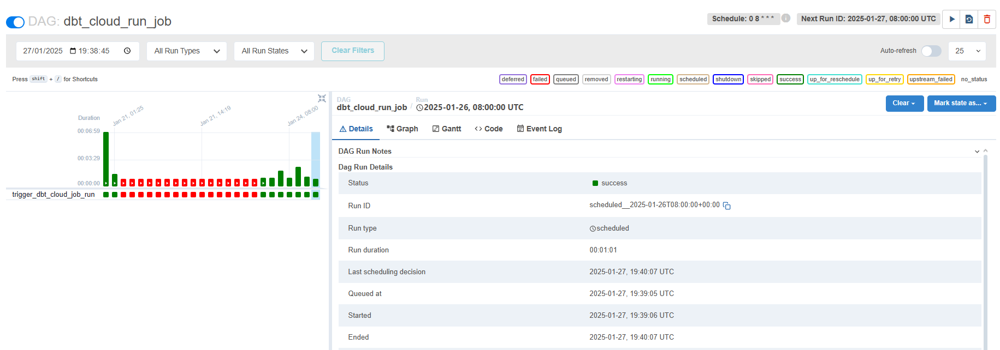

# **Projeto Airflow - DAG para Execução de DBT**

## **Descrição do Projeto**
Este projeto implementa uma DAG no Apache Airflow para automatizar a execução de tarefas relacionadas a modelos do DBT. A DAG é configurada para:

1. **Agendamento Diário**: Executa automaticamente uma vez por dia, em um horário definido.
2. **Execução de Testes e Transformações**:
   - Acessa o repositório onde os modelos do DBT estão localizados.
   - Executa os testes definidos no DBT.
   - Realiza as transformações especificadas nos modelos.
3. **Conexão com o Data Warehouse (DW)**: Certifica-se de que a conexão com o DW esteja configurada no arquivo `profiles.yml` do DBT.
4. **Critério de Sucesso**: A DAG deve ser capaz de rodar com sucesso **três vezes consecutivas**.

---

## **Arquitetura do Projeto**
### Estrutura da DAG:
- **Tarefa 1**: Clonar/Acessar o repositório do DBT.
- **Tarefa 2**: Validar e rodar os testes do DBT.
- **Tarefa 3**: Executar as transformações usando o DBT.

A execução das tarefas é orquestrada utilizando dependências definidas no Airflow, garantindo que todas as etapas sejam executadas na sequência correta.

---

## **Pré-requisitos**
Antes de executar este projeto, certifique-se de que as seguintes dependências estão instaladas e configuradas:

1. **Apache Airflow**: Certifique-se de que o Airflow está instalado e funcionando no ambiente.
2. **DBT**:
   - O repositório dos modelos do DBT deve estar acessível.
   - O arquivo `profiles.yml` do DBT deve conter a configuração correta para o DW utilizado pela DAG.
3. **Configuração do Airflow**:
   - O Airflow deve estar configurado com uma conexão ao Data Warehouse.
   - Certifique-se de que a DAG está habilitada no Airflow.

## **Critérios de Sucesso**
  - A DAG deve ser executada diariamente no horário configurado.
  - Todas as etapas (testes e transformações do DBT) devem ser concluídas sem erros.
  - A DAG deve rodar com sucesso 3 vezes consecutivas.

  